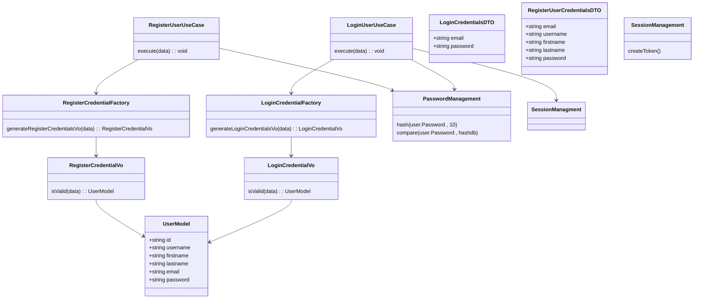

# Diagramme de class AuthModule

```mermaid

classDiagram

    class UserModel{
        +string id
        +string username
        +string firstname
        +string lastname
        +string email
        +string password
    }

    class RegisterUserUseCase{
        execute(data) : void
    }
    class LoginUserUseCase{
        execute(data) : void
    }

    class LoginCredentialVo{
        isValid(data) : UserModel
    }
    class RegisterCredentialVo{
        isValid(data) : UserModel
    }

    class LoginCredentialFactory{
        generateLoginCredentialsVo(data) : LoginCredentialVo
    }
    class RegisterCredentialFactory{
        generateRegisterCredentialsVo(data) : RegisterCredentialVo
    }

    class LoginCredentialsDTO{
        +string email 
        +string password
    }

    class RegisterUserCredentialsDTO{
        +string email
        +string username
        +string firstname
        +string lastname
        +string password
    }

    class PasswordManagement{
        hash(user.Password , 10)
        compare(user.Password , hashdb)
    }

    class SessionManagement{
        createToken()
    }

    %% Relations
    RegisterUserUseCase --> RegisterCredentialFactory
    LoginUserUseCase --> LoginCredentialFactory
    RegisterUserUseCase --> PasswordManagement
    LoginUserUseCase --> PasswordManagement 
    LoginUserUseCase--> SessionManagment
    RegisterCredentialFactory --> RegisterCredentialVo
    LoginCredentialFactory --> LoginCredentialVo
    RegisterCredentialVo --> UserModel
    LoginCredentialVo --> UserModel
```